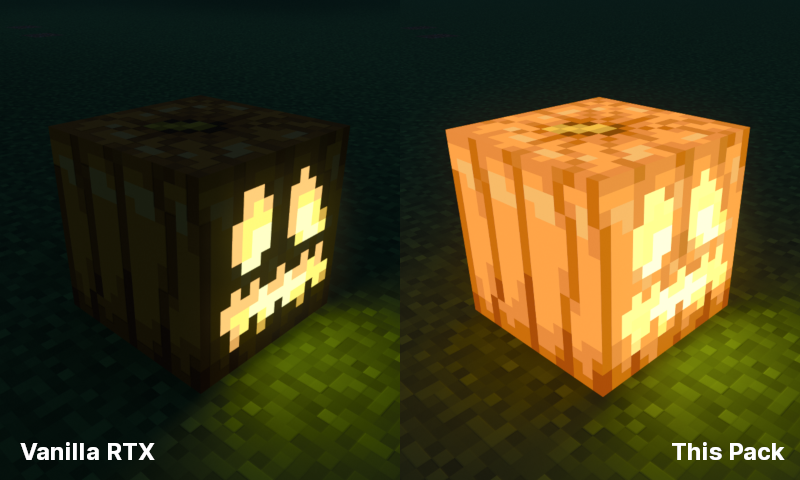

# Lit Pumpkin Mod for Vanilla RTX

这是让南瓜灯的光效符合大众认知上（整个南瓜都在亮）的Vanilla RTX附加包，当然，**也可以配合别的光追材质包使用**。

A Vanilla RTX addon pack that makes Jack'o'Lanterns have same light effect with non-RTX environment, **may also work with other RTX packs**.

---

这个包为有这种需要的人（包括我）制作。

This pack is made for people who needs it, include me.

---

去瞧瞧Vanilla RTX的GitHub仓库：

Check out the Vanilla RTX GitHub Repository:

https://github.com/CubeIR/Vanilla-RTX

---

使用效果对比：

---

texture文件夹内的PNG图片借用自Vanilla RTX项目并稍作修改，仅用于此材质包。

PNG images in texture folder is borrowed and modified from Vanilla RTX repo, for this texture pack purpose only.
